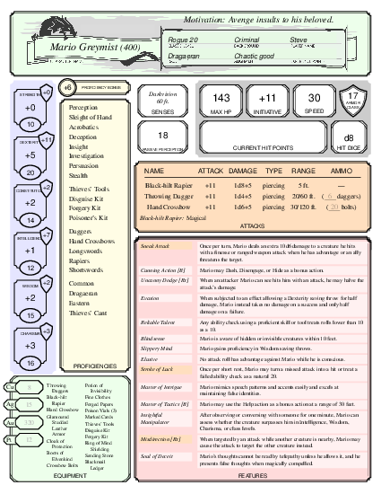

# Introduction

When I play D&D, I love the convenience of a paper character sheet.
Everything I need to know is right in front of me; there is no
mousing, clicking, tapping, or other fiddling with devices.
But when my character levels up or prepares new spells, 
updating a paper sheet is a nuisance, and so is copying out my character to a new sheet.
This project tries to provide the best of both worlds.

This project works with a "digital character sheet" that is plain text and is meant to be edited and maintained with a simple, ordinary text editor like Emacs, vim, or Notepad.  The text of the character sheet is a form of [YAML](https://en.wikipedia.org/wiki/YAML) ([decent beginner tutorial](https://www.cloudbees.com/blog/yaml-tutorial-everything-you-need-get-started)), which I consider reasonably user-friendly while still being machine-readable.  A character sheet might start something like this:

```
CHARACTER NAME: Mario Greymist
CLASS: Rogue
LEVEL: 20
PLAYER NAME: Steve
RACE: Dragaeran 
ALIGNMENT: Chaotic good

STR: 10
DEX: 20
CON: 14
INT: 12
WIS: 15
CHA: 16

PROFICIENCIES:
  - Perception
  - Sleight of Hand
  - 
  - Daggers
# ... and so on
```

The software can then produce [a PDF suitable for printing and using at the table](mario.pdf).\
Preview:

<a href="mario.pdf">

</a>

The software runs on Linux---the Angry GM uses Linux now, you know---but for those who don't wish to fool around with installing it and getting it to work, I provide [a web service](https://dnd-character-sheets.github.io).

# Using the web service

Most of the web service is a form that describes your character.
The service does a little calculation (modifiers from your stats, proficiency bonus from your level), but most work is left to you (how many spell slots your character has at each level, for example).

The key bits are at the top.  When you are first getting started you might try something like this:

 1. Go to the web service and select a pregenerated character from one of the dropdowns.  Then click "Load this character."
 
 2. Fill in missing fields, edit what's there, and otherwise make the character your own.
 
 3. Click the "Generate PDF" button to see what your character sheet will look like.
 
 4. Click the "Download _name_`.yaml`" button to save your work.

The web form is intended primarily for demo purposes—and not merely because I am a crap web designer.
In the long term, you will
ideally use the service something like this:

 5. Edit your YAML character sheet on the comfort of your own machine.

 6. Go to the web service and use the "Load YAML file" button to load your character sheet into the web form.
 
 7. Get PDF by clicking "Generate PDF."

# Working with YAML on your own

## Yaml for beginners

Key-value pairs, with colons
Looks like markdown lists.
Best to follow examples.

round-trip through web form is meant to preserve, though some fields may be added, and sometimes empty space following a dash will render as `null`.
and blank lines are necessarily lost.

Markdown, colons

## YAML for this project

AI doco :-(

## Quick start

quickstart

## What you can write in your YAML fields

LaTeX

bespoke macros


## All the YAML keys

A D&D character sheet contains many pieces of information, and each one has its own YAML key. [HOW MANY TOTAL, ROUGHLY].

YAML.md

## Standard YAML you can use with your own characters

I have yamls.

## Getting YAML from other digital character sheets

There are eight million ~~stories~~ digital character sheets in the ~~naked city~~ various corners of the Web.
Trying to create software to convert from one to the other is a mug's game.  But if you are willing to use a large language model, the popular chatbots can do a pretty good job extracting the right YAML from a web page or PDF.
You can show the bot an example YAML sheet or the user documentation and then ask it to convert.


# Deliberate omissions

The layouts and YAML forms do not support all of the options available in D&D 5e (2014).

  - Traits, bonds, ideals, and so on are aspects of a D&D character that are best developed during play, not decided beforehand at character-creation time.  Accordingly, they are not found on the character sheet.
  
  - Electrum pieces clutter the character sheet and tend to confuse players because unlike the other coins, they are not ten times as valuable as the next most valuable coin.  Copper, silver, gold, and platinum provide plenty of variety to work with.

# Character-sheet layouts

Although I have some training in information design,
I am not a graphic designer.
If you want to recommend support for another layout, please open an issue.

# Notes on sources

AI used.  Link to Nox, Silverpine W, Alyssa sheets

Thanks to "Alyssa" for the two-column character-sheet layout (`silverpine`) that is used in _The Fall of Silverpine Watch_.
Thanks to NoxAeternus for the three-column (`3col`) style.
Thanks to French Rice Merman for the `tropical` style.


